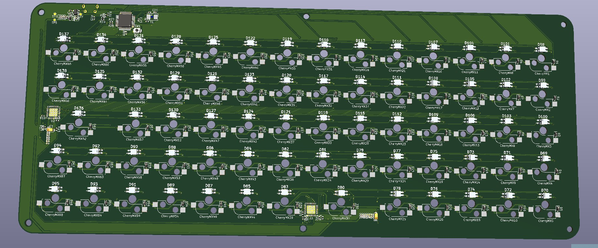

# thekeyboard

## License

This project (not include ./hardware/KiCad/) are under MIT license.

## Code

Haven't started yet, planning on start from ChibiOS

## Hardware

I'm attempting to draw the PCB and its my first time drawing a PCB so 0 confidence it will work. I did my research and if you want to use it plz do your own research make sure it works.

I have not yet tested the PCB, the keyboard PCB currently looks like this:

The keyboard uses STM32F303CCT6, IS31FL3733 and have perKey RGB. NOTHING HAD BEEN TESTED SO DON'T TRY TO MAKE THIS PLZ.

~~I'm too lazy to post the 3d model today~~

Here is the fusion 360 3d model, didn't test it.

https://a360.co/2NjABAU

## Layout

The blue keys' function depend on use case

## Render

