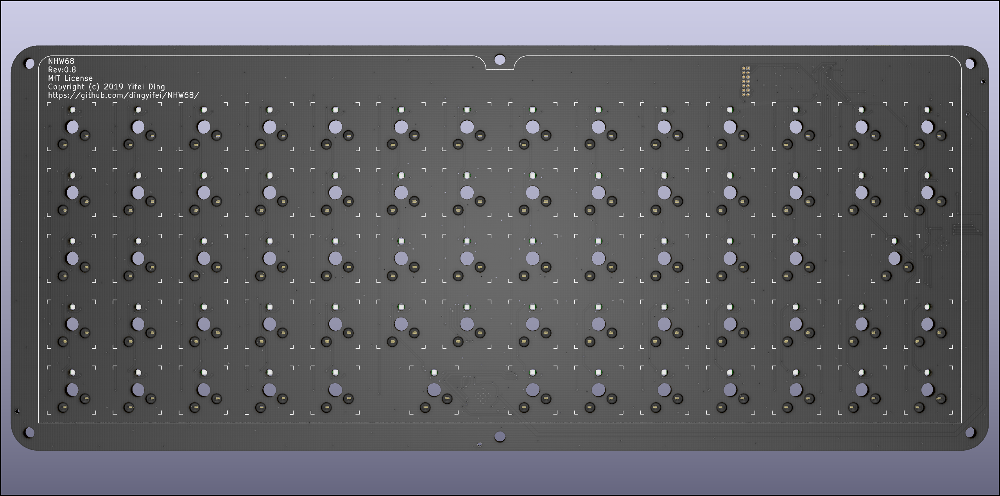

# Not Hand Wired 68 Keys

## License

This project (not include ./hardware/KiCad/, ./code, or files with licenses inside them) is using MIT license.

If not specified, the files in ./code are GPL V2

## Code

Code should be functional, haven't push it to QMK or tested on the keyboard yet, compile passed.

## Hardware

I'm attempting to draw the PCB and its my first time drawing a PCB so 0 confidence it will work. I did my research and if you want to use it plz do your own research make sure it works.

I have not yet tested the PCB, the keyboard PCB currently looks like this:

The keyboard uses STM32F303CCT6, IS31FL3733 and have per Key RGB. 

The RGB is optional since it can work without RGB (I believe most people can live without RGB :p)

Here is the fusion 360 3d mode, I think it is good enough

Fusion 360 Link: https://a360.co/2X8L0Fb

**Note: The screws and nuts are download from misumi, license info can be found on misumi**

## Layout

The blue keys' function depend on use case

## Assembly

Stacking: 

1. Plate(1.6mm)
2. Spacer(1.2mm)x3
3. PCB(1.6mm)
4. Nuts(2.4mm or more)
5. Spacer(1.2mm)
6. Base(1.6mm)
7. Nuts(2.4mm)

Use 16mm~18mm M3 screw and nuts should be just fine, a PCB fab usually provide 1.6mm and 1.2mm.

Note: Manually cut 2 spacer PCB can replace the 4. Nuts but it would mean you need to choose "Order 10" option in the most fabs (which would increase the difficulty in sourcing all the parts)

## Cost

5 piece of (Spacer, PCB, Plate, Base) - $60 if you choose leaded HSAL

Parts are relatively cheap and you don't have to worry about them, LCSC is a good place to get all those parts(u probably need Amazon for Kailh hot swap, Digikey for RGB controller)

## Caution

The RGB LEDs can be hard to find, this model number is rare.